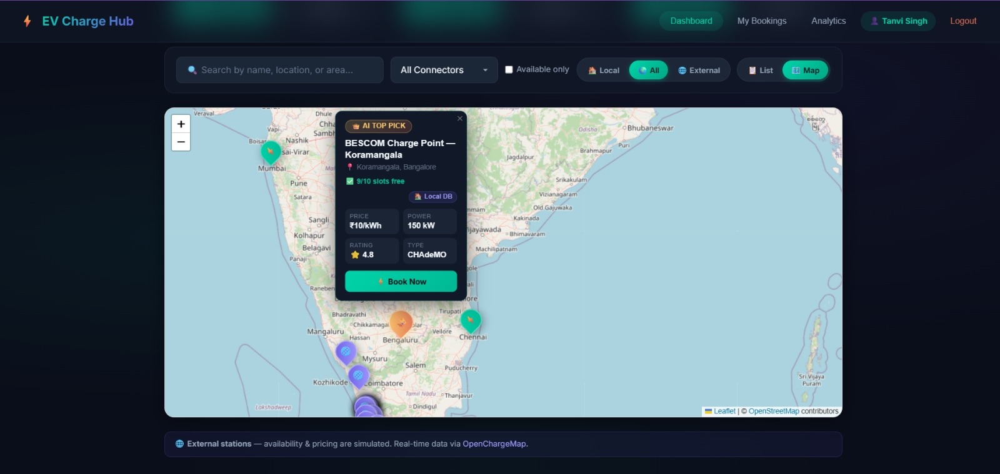
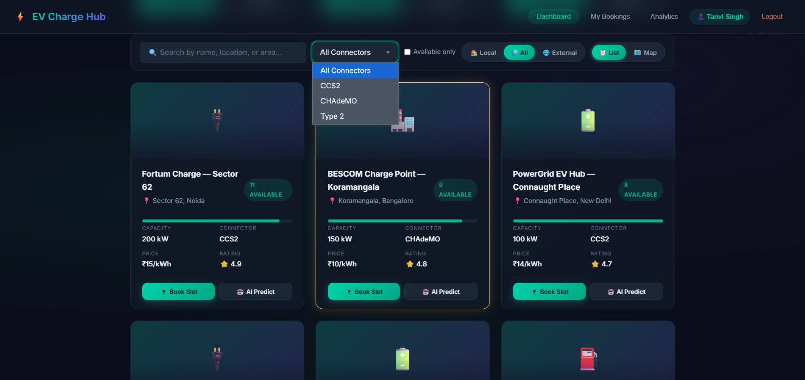
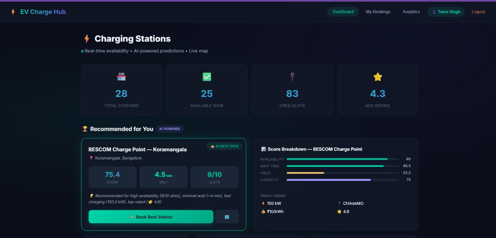
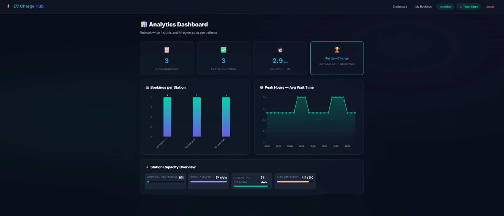
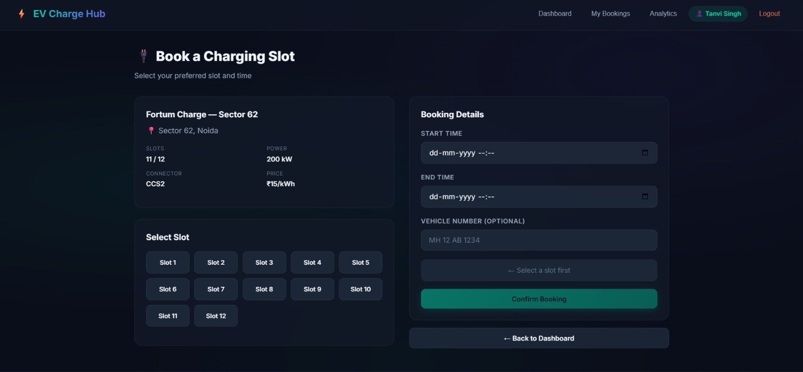

<div align="center">

# ⚡ EV Charge Hub
**AI-Powered EV Charging Optimization Platform**

[](https://fastapi.tiangolo.com/)
[](https://reactjs.org/)
[](https://vitejs.dev/)
[](https://scikit-learn.org/)
[](https://developer.mozilla.org/en-US/docs/Web/API/WebSockets_API)
[](https://www.python.org/)

*Navigate smarter. Charge faster. Predict the wait.*

</div>

---

## 🌟 Why This Project Stands Out

Most applications are basic CRUD interfaces. **This is a decision-making system.** 
EV Charge Hub combines an **AI Inference Layer**, **Real-Time WebSockets**, and **External Data Syncs** into a unified distributed architecture. It doesn't just display charging stations; it ingests live constraint data, predicts charger availability using Machine Learning, and probabilistically matches drivers to the perfect station dynamically based on spatial and temporal factors.

---

## 🌟 Demo & Visuals

### 🎥 System Demo
<p align="center">
  
</p>

### Interactive Map View & Recommendations
<p align="center">
  
  <br/>
  <br/>
  
</p>

### Dashboard & Analytics
<p align="center">
  
  <br/>
  <br/>
  
</p>

### Booking Flow
<p align="center">
  
</p>

---

## 🤖 AI System

The core value proposition of this platform is the Intelligence Engine. The system processes thousands of data points to ensure users never wait blindly for an EV plug.

### 1. Wait-Time Prediction (Machine Learning)
A **Random Forest Regressor** trained on historical charging sessions operates at the core of the system.
* **Input Features:** `[day_of_week, hour_of_day, active_bookings, total_plugs, max_power_kw]`
* **Model Output:** A highly granular, continuous estimated waiting time (`minutes`).
* **Continuous Integration:** Model inferences are serialized instantly whenever a user queries station availability.

### 2. Multi-Factor Recommendation Engine
The system dynamically scores and ranks stations based on a hybrid heuristic, weighing predictive constraints against the user's spatial context.

```python
def calculate_recommendation_score(station, user_location):
    """
    Dynamically computes a ranking score for any given station.
    """
    availability_weight = 0.4
    wait_time_weight = 0.3
    distance_weight = 0.2
    price_weight = 0.1

    # Invert wait time, distance, and price penalties
    score = (
        (availability_weight * station.available_plugs) -
        (wait_time_weight * station.predicted_wait_time_mins) -
        (distance_weight * calculate_distance(station.location, user_location)) -
        (price_weight * station.price_per_kwh)
    )
    
    return max(0, score)
```

---

## 🏗️ System Architecture

Our robust, decoupled architecture separates concerns to scale massively and provide exceptionally fast processing for heavy AI matrices.

```text
    ┌──────────────────────────────────────────────┐
    │              Frontend (Vite SPA)             │
    │        React │ Leaflet.js │ Tailwind         │
    └──────────────────────┬───────────────────────┘
                           │
             REST API + WebSockets (WSS)
                           │
    ┌──────────────────────▼───────────────────────┐
    │              FastAPI Core Layer              │
    │    Authentication │ Routing │ WSS Manager    │
    └──────────┬────────────────────────┬──────────┘
               │                        │
       ┌───────▼──────┐         ┌───────▼──────┐
       │ AI Decision  │         │ External API │
       │    Engine    │         │ (OpenCharge) │
       │ Pred + Recom │         │ Global Sync  │
       └───────┬──────┘         └───────┬──────┘
               │                        │
    ┌──────────▼────────────────────────▼──────────┐
    │                 Database Layer               │
    │             Transactions │ Analytics         │
    └──────────────────────────────────────────────┘
```

**Architecture Breakdown:-**
* **Modular System Design:** Micro-services decoupled by distinct bounded contexts (`FastAPI Core Layer`, `AI Decision Engine`, `External API Sync`).
* **Real-Time Communication:** A persistent WSS manager broadcasts live availability state mutations instantly to all connected Vite clients.
* **AI Inference Layer:** A dedicated Scikit-Learn service structured to rapidly extract predictions for heavy mathematical wait-time matrices.
* **Hybrid Data System:** Relies on local transactional storage (PostgreSQL/SQLite) while constantly federating, sanitizing, and caching constraints globally from the OpenChargeMap API.

---

## ✨ Features

### 🧠 AI Intelligence
- **Recommendation Engine:** Ranks charging stations instantly through a multi-factor mathematical scoring model.
- **Wait-Time Prediction:** Employs Random Forest regression to estimate how long a user will wait before a plug frees up.

### ⚡ Real-Time System
- **WebSockets Manager:** Live station availability, dynamic pricing, and immediate booking status updates pushed seamlessly to the client.

### 🌍 Data Integration
- **OpenChargeMap Sync:** Ingests live charging location endpoints and sanitizes constraints for global or regional discovery.

### 🗺️ Map & Visualization
- **Interactive Spatial Layout:** A sleek Leaflet-based map delivering an intuitive interface to uncover nearby charge points visually.

### 📊 Analytics
- **System Dashboard:** A comprehensive breakdown of user charging metrics, station usage patterns, and historical trends.

### 🔐 Authentication & Booking
- **Secure Sessions:** JWT-encrypted login, registration, and persistent booking management seamlessly tracked across the platform.

---

## 🚀 Setup & Installation

### 1. ML Pipeline Setup
Generates the foundational predictive models for the AI Decision Engine.
```bash
cd ml
pip install -r requirements.txt
python generate_dataset.py
python train_model.py
```

### 2. Backend Setup
Initializes the FastAPI Core Layer and WSS Manager.
```bash
cd backend
python -m venv venv
source venv/bin/activate       # Windows: venv\Scripts\activate
pip install -r requirements.txt
uvicorn app.main:app --reload --port 8000
```

### 3. Frontend Setup
Launches the Vite SPA.
```bash
cd frontend
npm install
npm run dev
```

Visit `http://localhost:5173` to explore the live system.

---

## 🔌 API Endpoints

### 🔐 Auth
- `POST /api/auth/register` - Create a new user account.
- `POST /api/auth/login` - Retrieve access tokens (JWT).

### ⛽ Stations
- `GET /api/stations` - Fetch all stations globally.
- `GET /api/stations/{id}` - Retrieve details for a specific station.

### 🧠 Recommendation & ML
- `GET /api/stations/recommend` - **[AI]** Returns a smartly ranked list of stations tailored for the user.
- `POST /api/predict/wait-time` - **[AI]** Infers predictive wait times.

### 📈 Analytics
- `GET /api/analytics/dashboard` - Fetches aggregated system metrics.

### 🌍 External Data
- `GET /api/external/openchargemap` - Proxy route to pull EV station details from OpenChargeMap.

---

<div align="center">
  <b>Built with ❤️ for a Greener Future.</b>
</div>
